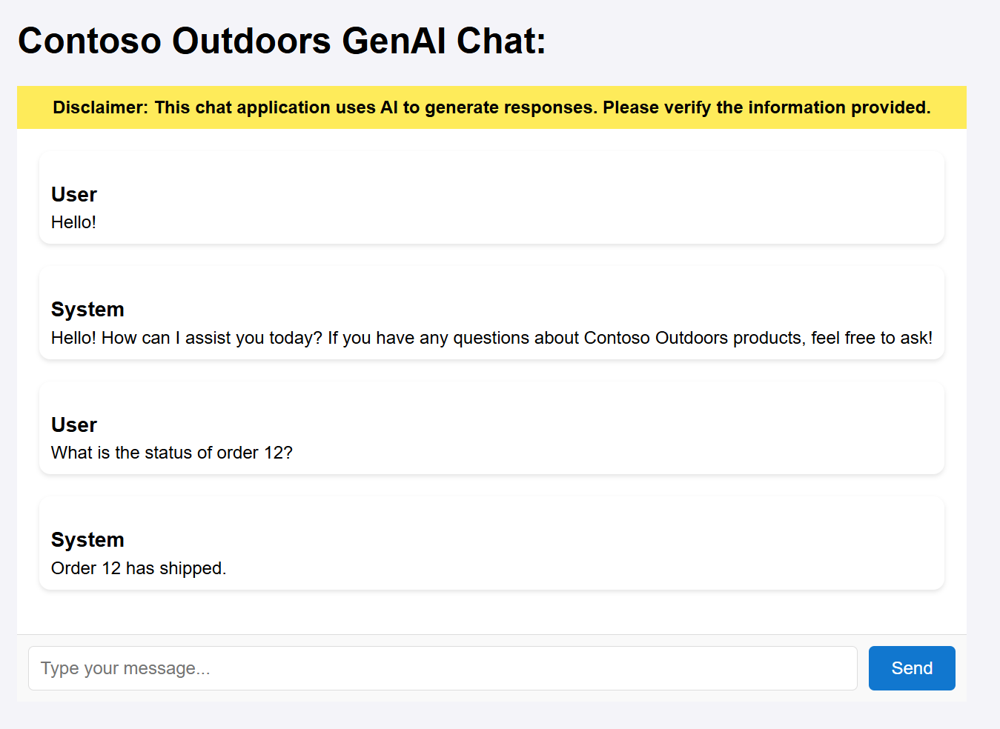
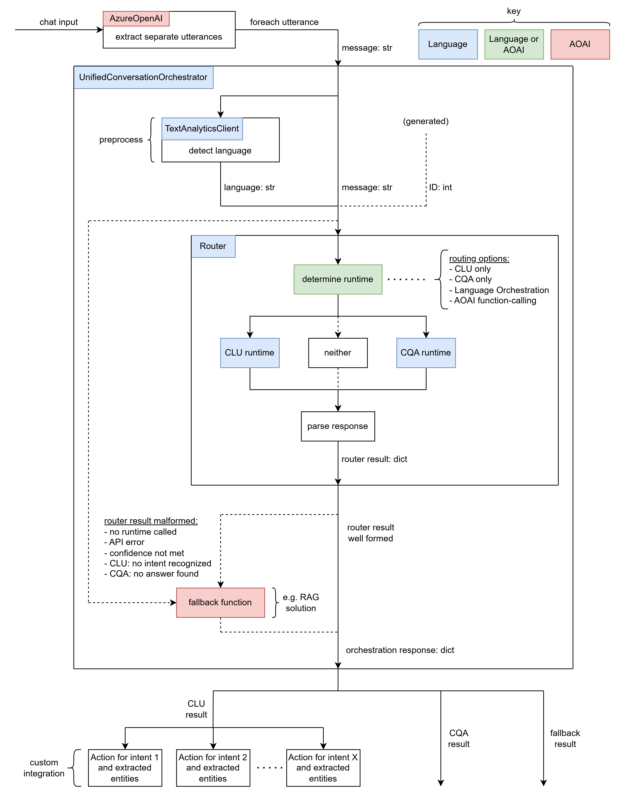

# Azure Language OpenAI Conversational Agent Accelerator

### Overview
This solution accelerator provides users with a code-first example on how to augment an existing `RAG` solution with Azure AI Language functionality. It leverages Conversational Language Understanding (`CLU`) and Custom Question Answering (`CQA`) to dynamically improve a `RAG` chat experience. 

**Harness the capabilities of Azure AI Language and Azure OpenAI together.**

Below is an image of the solution accelerator:



### Use Case / Scenario
A typical `RAG` solution allows users to chat with an AI assistant and obtained grounded responses. Chat messages are sent directly to AOAI, where a specified model (e.g. GPT-4o) processes each message and creates a response.
This is beneficial when customers have their own grounding data (e.g. product manuals, company information for Q/A). They would set up an Azure AI Search index to query their grounding data, and preprocess user chat messages by fetching relevant grounding data and passing it to the AOAI model downstream.
Because the model now "knows" the grounding data to base its response around, user chats are met with contextual responses, improving the chat experience.

However, issues with `RAG` solutions (DSATs, or dissatisfactory examples) are hard to address. It is hard to debug or update grounding data to fix inaccurate "grounded" responses. Further, this process can be timely and expensive.

Azure AI Language can help address these issues and expand the functionality of existing `RAG` chat solutions. Azure AI Language already offers two services: Conversational Language Understanding (`CLU`) and Custom Question Answering (`CQA`).
`CLU` analyzes user inputs to extract intents and entities. `CQA` uses pre-defined question-answer pairs or a pre-configured knowledgebase to answer user questions.

### Solution Architecture


This project includes a `UnifiedConversationOrchestrator` class that unifies both `CLU` and `CQA` functionality. Using a variety of different routing strategies, this orchestrator can intelligently route user input to a `CLU` or `CQA` model.
There is also fallback functionality when any of the following occurs: neither runtime is called, API call failed, confidence threshold not met, `CLU` did not recognize an intent, `CQA` failed to answer the question.
This fallback functionality can be configured to be any function. In this user-story, fallback will be the original `RAG` solution. The orchestrator object takes a string message as input, and outputs a dictionary object containing information regarding what runtime was called, relevant outputs, was fallback called, etc.

When combined with an existing `RAG` solution, adding a `UnifiedConversationOrchestrator` can help in the following ways:
- manual overrides of DSAT examples using `CQA`.
- extended chat functionality based on recognized intents/entities using `CLU`.
- consistent fallback to original chat functionality with `RAG`.
Further, users can provide their own business logic to call based on `CLU` results (e.g. with an `OrderStatus` intent and `OrderId` entity, user can include business logic to query a database to check the order status).

The container app demo included with this project showcases the following chat experience:
- user inputs chat dialog.
- AOAI node preprocesses by breaking input into separate utterances.
- Orchestrator routes each utterance to either `CLU`, `CQA`, or fallback `RAG`.
- If `CLU` was called, call extended business logic based on intent/entities.
- Agent summarizes response (what business action was performed, provide answer to question, provide grounded response).

**Consider the following real-world example:**
A customer, Contoso Outdoors, has an existing `RAG` chat solution using AOAI. Their grounding data is composed of product manuals of the outdoor gear they sell.
Because of this, users can easily ask the AI chat questions regarding Contoso Outdoors products (e.g. What tents do you sell?) and obtain grounded, contextual, and accurate responses.

However, if a user asks questions about the company's return policy, the `RAG` chat will not be able to respond accurately, as the grounding data does not contain any information regarding a return policy.
It can be expensive and time consuming to update the grounding data to address this. Further, if a user asks a question about their online order status, even with updates of grounding data, `RAG` is not able to respond effectively here, as information is dynamic.

Incorporating `CLU`/`CQA` using a `UnifiedConversationOrchestrator` solves these problems. Contoso Outdoors would set up a `CQA`   model that can answer extended questions (e.g. their return policy), and set up a `CLU` model that can identify online order actions (e.g. checking the status of an order).
Now, both of these DSATs are resolved, and Contoso Outdoors still maintains their existing `RAG` chat functionality, as `UnifiedConversationOrchestrator` falls back to the original `RAG` chat if `CLU`/`CQA` are not fit to respond to the user chat.

This displays the "better together" story when using Azure AI Language and Azure OpenAI.

**Note:** GenAI is used in the following contexts:
- demo code: general AOAI GPT chat client to break user inputs into separate utterances.
- demo code: general AOAI GPT `RAG` client to provide grounded responses as a fallback function.
- orchestrator: one routing option uses AOAI GPT function-calling to decide whether to call `CLU` or `CQA` runtimes.

**Note:** This project includes sample data to create project dependencies. Sample data is in the context of a fictionary outdoor product company: Contoso Outdoors.

**Note:** Routing strategies:
- `BYPASS`: No routing. Only call fallback function.
- `CLU`: Route to `CLU` runtime only.
- `CQA`: Route to `CQA` runtime only.
- `ORCHESTRATION`: Route to either `CQA` or `CLU` runtime using an Azure AI Language [Orchestration](https://learn.microsoft.com/en-us/azure/ai-services/language-service/orchestration-workflow/overview) project to decide. 
- `FUNCTION_CALLING`: Route to either `CLU` or `CQA` runtime using AOAI GPT function-calling to decide.

In any case, the fallback function is called if routing "failed". `CLU` route is considered "failed" is confidence threshold is not met or no intent is recognized. `CQA` route is considered "failed" if confidence threhsold is not met or no answer is found. `ORCHESTRATION` and `FUNCTION_CALLING` routes depend on the return value of the runtime they call.

### **Prerequisites**
To deploy this solution accelerator, ensure you have access to an [Azure subscription](https://azure.microsoft.com/free/) with the necessary permissions to create **resource groups and resources**. Follow the steps in  [Azure Account Set Up](./docs/azure_account_set_up.md).

Check the [Azure Products by Region](https://azure.microsoft.com/en-us/explore/global-infrastructure/products-by-region/?products=all&regions=all) page and select a **region** where the following services are available (e.g. EastUS2):  

- Azure OpenAI
- Azure AI Language
- Azure AI Search
- [Azure Semantic Search](./docs/azure_semantic_search_region.md)  
- Storage Account
- Container Registry
- Container App
- Managed Identity

### **Configurable Deployment Settings**
When you start the deployment, most parameters will have **default values**, but you can update the following settings:  

| **Setting** | **Description** |  **Default value** |
|------------|----------------|  ------------|
| **GPT Deployment Type** | `GlobalStandard` or `Standard` |  `GlobalStandard` |
| **GPT Model Name** |  `gpt-4`, `gpt-4o`, or `gpt-4o-mini` | `gpt-4o-mini` |  
| **GPT Model Deployment Capacity** | Configure capacity for **GPT model deployment** | `20k` |
| **Embedding Model name** | Default: `text-embedding-ada-002` | `text-embedding-ada-002` |
| **Embedding Model Capacity** | Configure capacity for **embedding model deployment** |  `20k` |

### [Optional] Quota Recommendations  
By default, model deployment capacities are set to **20k tokens**. This small value ensures an adequate testing/demo experience, but is not meant for production workloads.  
> **We recommend increasing the capacity for optimal performance under large loads.** 

To adjust quota settings, follow these [steps](./docs/check_quota_settings.md)  

**⚠️ Warning:**  **Insufficient quota can cause deployment errors.** Please ensure you have the recommended capacity or request for additional capacity before deploying this solution.

### Deployment Options
Pick from the options below to see step-by-step instructions for: GitHub Codespaces, VS Code Dev Containers, Local Environments, and Bicep deployments.

<details>
  <summary><b>Deploy in GitHub Codespaces</b></summary>

### GitHub Codespaces

You can run this solution using GitHub Codespaces. The button will open a web-based VS Code instance in your browser:

1. Open the solution accelerator (this may take several minutes):

    [](https://codespaces.new/Azure-Samples/Azure-Language-OpenAI-Conversational-Agent-Accelerator)

2. Accept the default values on the create Codespaces page.
3. Open a terminal window if it is not already open.
4. Continue with the [deploying steps](#deploying).

</details>

<details>
  <summary><b>Deploy in VS Code</b></summary>

 ### VS Code Dev Containers

You can run this solution in VS Code Dev Containers, which will open the project in your local VS Code using the [Dev Containers extension](https://marketplace.visualstudio.com/items?itemName=ms-vscode-remote.remote-containers):

1. Start Docker Desktop (install it, if not already installed)
2. Open the project:

    [](https://vscode.dev/redirect?url=vscode://ms-vscode-remote.remote-containers/cloneInVolume?url=https://github.com/Azure-Samples/Azure-Language-OpenAI-Conversational-Agent-Accelerator)


3. In the VS Code window that opens, once the project files show up (this may take several minutes), open a terminal window.
4. Continue with the [deploying steps](#deploying).

</details>

<details>
  <summary><b>Deploy in your local environment</b></summary>

 ### Local environment

If you're not using one of the above options for opening the project, then you'll need to:

1. Make sure the following tools are installed:

    * [Azure Developer CLI (azd)](https://aka.ms/install-azd)
    * [Docker Desktop](https://www.docker.com/products/docker-desktop/)
    * [Git](https://git-scm.com/downloads)

2. Download the project code:

    ```shell
    azd init -t Azure-Samples/Azure-Language-OpenAI-Conversational-Agent-Accelerator/
    ```

3. Open the project folder in your terminal or editor.

4. Continue with the [deploying steps](#deploying).

</details>

<details>
  <summary><b>Deploy with Bicep/ARM template</b></summary>

### Bicep
 
   Click the following deployment button to create the required resources for this solution directly in your Azure Subscription.

   [](https://portal.azure.com/#create/Microsoft.Template/uri/https%3A%2F%2Fraw.githubusercontent.com%2FAzure-Samples%2FAzure-Language-OpenAI-Conversational-Agent-Accelerator%2Fmain%2Finfra%2Fmain.json)          

</details>

### Deploying

Once you've opened the project in [Codespaces](#github-codespaces) or in [Dev Containers](#vs-code-dev-containers) or [locally](#local-environment), you can deploy it to Azure following the following steps. 

To change the azd parameters from the default values, follow the steps [here](./docs/customizing_azd_parameters.md). 


1. Login to Azure:

    ```shell
    azd auth login
    ```

    #### To authenticate with Azure Developer CLI (`azd`), use the following command with your **Tenant ID**:

    ```sh
    azd auth login --tenant-id <tenant-id>
   ```

2. Provision and deploy all the resources:

    ```shell
    azd up
    ```

3. Provide an `azd` environment name (like "conv-agent")
4. Select a subscription from your Azure account, and select a location which has quota for all the resources. 
    * This deployment will take *10-15 minutes* to provision the resources in your account and set up the solution with sample data. 
    * If you get an error or timeout with deployment, changing the location can help, as there may be availability constraints for the resources.

5. Once the deployment has completed successfully, open the [Azure Portal](https://portal.azure.com/), go to the deployed resource group, find the Container App resource and get the app URL from `Application Url`.

6. You can now delete the resources by running `azd down`, if you are done trying out the application. 
<!-- 6. You can now proceed to run the [development server](#development-server) to test the app locally, or if you are done trying out the app, you can delete the resources by running `azd down`. -->

<h2>
Additional Steps
</h2>


1. **Add App Authentication**
   
    Follow steps listed [here](https://learn.microsoft.com/en-us/azure/container-apps/authentication-entra) to configure authenitcation in thecontainer app.

2. **Deleting Resources After a Failed Deployment**

     Follow steps in [Delete Resource Group](./docs/delete_resource_group.md) If your deployment fails and you need to clean up the resources.

## Sample Questions

To help you get started, here are some **Sample Questions** you can ask in the app:

- What is your return policy?
- What is the status of order 12?
- What tents are recommended for winter?
- What boots do you sell?

<h2>
Responsible AI Transparency FAQ 
</h2>

Please refer to [Transparency FAQ](./RAI_FAQ.md) for responsible AI transparency details of this solution accelerator.


<h2>
Supporting documentation
</h2>

### Costs

Pricing varies per region and usage, so it isn't possible to predict exact costs for your usage.
The majority of the Azure resources used in this infrastructure are on usage-based pricing tiers.
However, Azure Container Registry has a fixed cost per registry per day.

You can try the [Azure pricing calculator](https://azure.microsoft.com/en-us/pricing/calculator) for the resources:

* Azure AI Search: Standard tier, S1. Pricing is based on the number of documents and operations. [Pricing](https://azure.microsoft.com/pricing/details/search/)
* Azure Storage Account: Standard tier, LRS. Pricing is based on storage and operations. [Pricing](https://azure.microsoft.com/pricing/details/storage/blobs/)
* Azure OpenAI: S0 tier, defaults to gpt-4o-mini and text-embedding-ada-002 models. Pricing is based on token count. [Pricing](https://azure.microsoft.com/en-us/pricing/details/cognitive-services/openai-service/?msockid=3d25d5a7fe346936111ec024ff8e685c)
* Azure Container App: Consumption tier with 1 CPU, 2GiB memory/storage. Pricing is based on resource allocation, and each month allows for a certain amount of free usage. [Pricing](https://azure.microsoft.com/pricing/details/container-apps/)
* Azure Container Registry: Basic tier. [Pricing](https://azure.microsoft.com/pricing/details/container-registry/)
* Azure AI Langauage: S tier. [Pricing](https://azure.microsoft.com/en-us/pricing/details/cognitive-services/language-service/?msockid=3d25d5a7fe346936111ec024ff8e685c)

⚠️ To avoid unnecessary costs, remember to take down your app if it's no longer in use,
either by deleting the resource group in the Portal or running `azd down`.

### Security guidelines

This template uses [Managed Identity](https://learn.microsoft.com/entra/identity/managed-identities-azure-resources/overview) for local development and deployment.

To ensure continued best practices in your own repository, we recommend that anyone creating solutions based on our templates ensure that the [Github secret scanning](https://docs.github.com/code-security/secret-scanning/about-secret-scanning) setting is enabled.

You may want to consider additional security measures, such as:

* Enabling Microsoft Defender for Cloud to [secure your Azure resources](https://learn.microsoft.com/azure/security-center/defender-for-cloud).
* Protecting the Azure Container Apps instance with a [firewall](https://learn.microsoft.com/azure/container-apps/waf-app-gateway) and/or [Virtual Network](https://learn.microsoft.com/azure/container-apps/networking?tabs=workload-profiles-env%2Cazure-cli).

### Additional resources

- [Azure OpenAI](https://learn.microsoft.com/en-us/azure/ai-services/openai/overview)
- [Azure AI Search](https://learn.microsoft.com/en-us/azure/search/) 
- [Azure Container Apps](https://learn.microsoft.com/en-us/azure/container-apps/overview)
- [Azure AI Language](https://learn.microsoft.com/en-us/azure/ai-services/language-service/overview)
- [CLU](https://learn.microsoft.com/en-us/azure/ai-services/language-service/conversational-language-understanding/overview)
- [CQA](https://learn.microsoft.com/en-us/azure/ai-services/language-service/question-answering/overview)

## Disclaimers

To the extent that the Software includes components or code used in or derived from Microsoft products or services, including without limitation Microsoft Azure Services (collectively, “Microsoft Products and Services”), you must also comply with the Product Terms applicable to such Microsoft Products and Services. You acknowledge and agree that the license governing the Software does not grant you a license or other right to use Microsoft Products and Services. Nothing in the license or this ReadMe file will serve to supersede, amend, terminate or modify any terms in the Product Terms for any Microsoft Products and Services. 

You must also comply with all domestic and international export laws and regulations that apply to the Software, which include restrictions on destinations, end users, and end use. For further information on export restrictions, visit https://aka.ms/exporting. 

You acknowledge that the Software and Microsoft Products and Services (1) are not designed, intended or made available as a medical device(s), and (2) are not designed or intended to be a substitute for professional medical advice, diagnosis, treatment, or judgment and should not be used to replace or as a substitute for professional medical advice, diagnosis, treatment, or judgment. Customer is solely responsible for displaying and/or obtaining appropriate consents, warnings, disclaimers, and acknowledgements to end users of Customer’s implementation of the Online Services. 

You acknowledge the Software is not subject to SOC 1 and SOC 2 compliance audits. No Microsoft technology, nor any of its component technologies, including the Software, is intended or made available as a substitute for the professional advice, opinion, or judgement of a certified financial services professional. Do not use the Software to replace, substitute, or provide professional financial advice or judgment.  

BY ACCESSING OR USING THE SOFTWARE, YOU ACKNOWLEDGE THAT THE SOFTWARE IS NOT DESIGNED OR INTENDED TO SUPPORT ANY USE IN WHICH A SERVICE INTERRUPTION, DEFECT, ERROR, OR OTHER FAILURE OF THE SOFTWARE COULD RESULT IN THE DEATH OR SERIOUS BODILY INJURY OF ANY PERSON OR IN PHYSICAL OR ENVIRONMENTAL DAMAGE (COLLECTIVELY, “HIGH-RISK USE”), AND THAT YOU WILL ENSURE THAT, IN THE EVENT OF ANY INTERRUPTION, DEFECT, ERROR, OR OTHER FAILURE OF THE SOFTWARE, THE SAFETY OF PEOPLE, PROPERTY, AND THE ENVIRONMENT ARE NOT REDUCED BELOW A LEVEL THAT IS REASONABLY, APPROPRIATE, AND LEGAL, WHETHER IN GENERAL OR IN A SPECIFIC INDUSTRY. BY ACCESSING THE SOFTWARE, YOU FURTHER ACKNOWLEDGE THAT YOUR HIGH-RISK USE OF THE SOFTWARE IS AT YOUR OWN RISK.  

##  Trademarks: 
This project may contain trademarks or logos for projects, products, or services. Authorized use of Microsoft trademarks or logos is subject to and must follow [Microsoft’s Trademark & Brand Guidelines](https://www.microsoft.com/en-us/legal/intellectualproperty/trademarks/usage/general). Use of Microsoft trademarks or logos in modified versions of this project must not cause confusion or imply Microsoft sponsorship. Any use of third-party trademarks or logos are subject to those third-party’s policies.

## Data Collection:
The software may collect information about you and your use of the software and send it to Microsoft. Microsoft may use this information to provide services and improve our products and services. You may turn off the telemetry as described in the repository. There are also some features in the software that may enable you and Microsoft to collect data from users of your applications. If you use these features, you must comply with applicable law, including providing appropriate notices to users of your applications together with a copy of Microsoft’s privacy statement. Our privacy statement is located at https://go.microsoft.com/fwlink/?LinkID=824704. You can learn more about data collection and use in the help documentation and our privacy statement. Your use of the software operates as your consent to these practices.

**Note**: 
- No telemetry or data collection is directly added in this accelerator project. Please review individual telemetry information from the included Azure services (e.g. Azure AI Language, Azure OpenAI etc.) regarding their APIs.
