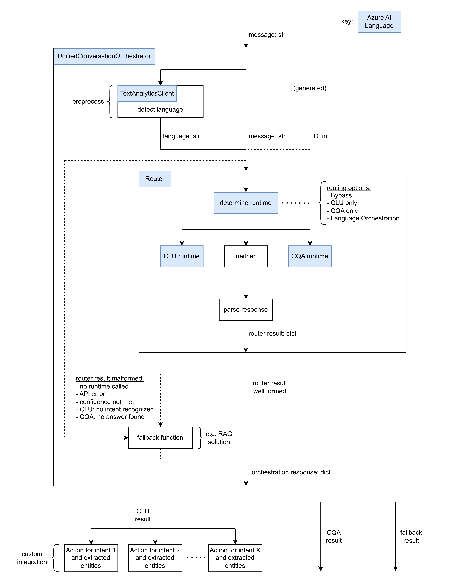

# Conversational Assistant

This project provides users with a code-first example on how to augment chat solutions with deterministic, human-controllable workflows.  

### Introduction:
This project uses key services from Azure AI Language in addition to Azure OpenAI, including PII detection to protect sensitive information, [Conversational Language Understanding](https://learn.microsoft.com/en-us/azure/ai-services/language-service/conversational-language-understanding/overview) (`CLU`) to predict top users’ intents, [Custom Question Answering](https://learn.microsoft.com/en-us/azure/ai-services/language-service/question-answering/overview) (`CQA`) to respond to top questions with deterministic answers. 
Together with Azure OpenAI and Large Language Models (LLMs), the solution is designed to orchestrate and deliver a smooth, human-guided, controllable and deterministic conversational experience. The integration with LLMs will come soon. 

It’s perfect for developers and organizations looking to build assistants that can handle complex queries, route tasks, and provide reliable answers, all with a controlled, scalable architecture.

### Solution:
This project includes a `UnifiedConversationOrchestrator` class that unifies both `CLU` and `CQA` functionality. Using a variety of different routing strategies, the orchestrator can intelligently route user input to either `CLU` or `CQA` runtimes, and upcoming GenAI powered intents. There is also fallback functionality when any of the following occurs: neither runtime is called, API call failed, confidence threshold not met, `CLU` did not recognize an intent, `CQA` failed to answer the question. This fallback functionality can be configured to be any function. The orchestrator object takes a string message as input, and outputs a dictionary object containing information regarding what runtime was called, relevant outputs, was fallback called, etc.

### Benefits:
While LLMs have been appreciated by many customers to build conversational assistants for natural, engaging, and context-aware interactions, there are challenges such as the significant efforts required in prompt engineering, document chunking, and reducing hallucinations to improve the quality of their Retrieval-Augmented Generation (RAG) solutions. If an AI quality issue is discovered in production, customers need to find an effective way to address it promptly. This solution aims to help customers utilize offerings in the Azure AI portfolio and address key challenges when building Generative AI (GenAI) assistants.

Designed for flexibility and reliability, this accelerator enables human-controllable workflows that meet real-world customer needs. It minimizes the need for extensive prompt engineering by using a structured workflow to prioritize top questions with exact answers and custom intents that are critical to your business and use LLM to handle topics in a conversation that have lower priorities. This architecture not only enhances answer quality and control but also ensures that complex queries are handled efficiently.

If you want to fix quickly an incorrect answer for your chatbot built with RAG, you can also attach this accelerator solution to your existing RAG solution and quickly add a QA pair with the correct response in CQA to fix the issue for your users.

Take the use case in this project as an example, `UnifiedConversationOrchestrator` can help in the following ways:
-	Manual overrides of DSAT examples using `CQA`.
-	Extended chat functionality based on recognized intents/entities using `CLU`.
-	Consistent fallback to original chat functionality with `RAG`.

Further, users can provide their own business logic to call based on `CLU` results (e.g. with an `OrderStatus` intent and `OrderId` entity, users can include business logic to query their database to check the order status).


### Architecture:

#### Key components of this solution include (components in dash boxes coming soon):

##### 1. Client-Side User Interface for Demonstration (coming soon)
A web-based client-side interface is included in the accelerator solution, to showcase the accelerator solution in an interactive, user-friendly format. This web UI allows you to quickly explore and test this solution, such as its orchestration routing behavior and functionalities.

##### 2. Workflow Orchestration for Human-Controllable Conversations
By combining services like CLU, CQA, and LLMs, the accelerator allows for a dynamic, adaptable workflow. CLU can recognize and route customer-defined intents, while CQA provides exact answers from predefined QA pairs. If a question falls outside the pre-defined scope, the workflow can seamlessly fall back to LLMs, which is enhanced with RAG for contextually relevant, accurate responses. This workflow ensures human-like adaptability while maintaining control over assistant responses.
##### 3. Conversational Language Understanding (CLU) for Intent Routing
The CLU service allows you to define the top intents you want the assistants to handle. The top intents can be those critical to your business and/or those most users ask your assistants. This component plays a central role in directing conversations by interpreting user intents and routing them to the right action or AI agents. Whether completing a task or addressing specific customer needs, CLU provides the mechanism to ensure the assistant accurately understands and executes the process of handling custom-defined intents.
##### 4.Custom Question Answering (CQA) for Exact Answers and with No Hallucinations
CQA allows you to create and manage predefined QA pairs to deliver precise responses, reducing ambiguity and ensuring that the assistant aligns closely with defined answers. This controlled response approach maintains consistency in interactions, improving reliability, particularly for high-stake or regulatory-sensitive conversations. You can also attach CQA to your existing RAG solution to quickly fix incorrect answers.
##### 5. PII Detection and Redaction for Privacy Protection (coming soon)
Protecting user privacy is a top priority, especially in conversational AI. This accelerator showcases an optional integration of Azure AI Language’s Personally Identifiable Information (PII) to automatically identify and redact sensitive information, if compliance with privacy standards and regulations is required

##### 6. LLM with RAG to Handle Everything Else (coming soon)
In this accelerator, we are using a RAG solution to handle missed intents or user queries on lower-priority topics. This RAG solution can be replaced with your existing one. The predefined intents and question-answer pairs can be appended and updated over time based on evolving business needs and DSATs (dissatisfaction) discovered in the RAG responses. This approach ensures controlled and deterministic experiences for high-value or high-priority topics while maintaining flexibility and extensibility for lower-priority interactions.
##### 7. Components Configuration for "Plug-and-Play"
One of the standout features of this accelerator is its flexibility through a "plug-and-play" component configuration. The architecture is designed to allow you to easily swap, add, or remove components to tailor the solution to your specific needs. Whether you want to add custom intents, adjust fallback mechanisms, or incorporate additional data sources, the modular nature of the accelerator makes it simple to configure.

### Example Data:
This project includes sample data designed to help you quickly explore its features and functionalities, making it easier for you to confidently integrate it with your business applications. The sample data is in the context of a fictional outdoor product company: Contoso Outdoors.

### Demo Experience:
The demo included with this project showcases the following chat experience:
-	User inputs chat.
-	Orchestrator routes input to either `CLU`, `CQA`, or fallback function.
-	If input was routed to `CLU`, call extended business logic based on recognized intent/entities.
-	Summarize routed response (what business action was performed, provide answer to question, fallback response).
-	Configuration file allowing you to plug and play features to tailor the flow

### Prerequisites:
Users must have an [Azure AI Language resource](https://learn.microsoft.com/en-us/azure/ai-services/language-service/overview). 

1. Create/activate a new Python/Conda environment.
2. Install requirements: `pip install -r requirement.txt`
3. Copy the contents of `.env_schema.txt` into a new file name `.env`.
4. Follow the notebooks in `/setup/*.ipynb` to setup relevant project dependencies and populate your `.env` file.
5. Ensure all variables in `.env` are populated with values.

### Run the Demo:
```
python demo.py
```
### Calling Stack:


### Routing Strategies:
- `BYPASS`: No routing. Only call fallback function.
- `CLU`: Route to CLU runtime only.
- `CQA`: Route to CQA runtime only.
- `ORCHESTRATION`: Route to either CQA or CLU runtime using an Azure AI Language [Orchestration](https://learn.microsoft.com/en-us/azure/ai-services/language-service/orchestration-workflow/overview) project to decide. 

In any case, the fallback function is called if routing "failed". `CLU` route is considered "failed" is confidence threshold is not met or no intent is recognized. `CQA` route is considered "failed" if confidence threhsold is not met or no answer is found. `ORCHESTRATION` route depends on the return value of the runtime it calls.

### Planned Updates:
- Add minimal demo chat UI.
- Integrate LLMs in demo/routing experience.
- Add PII redaction support for LLM calls.

### Third-Party Dependencies:
This projects makes use of the following third-party OSS Python packages:
- [requests](https://pypi.org/project/requests/)
- [azure-ai-textanalytics](https://pypi.org/project/azure-ai-textanalytics/)
- [azure-identity](https://pypi.org/project/azure-identity/)
- [python-dotenv](https://pypi.org/project/python-dotenv/)
